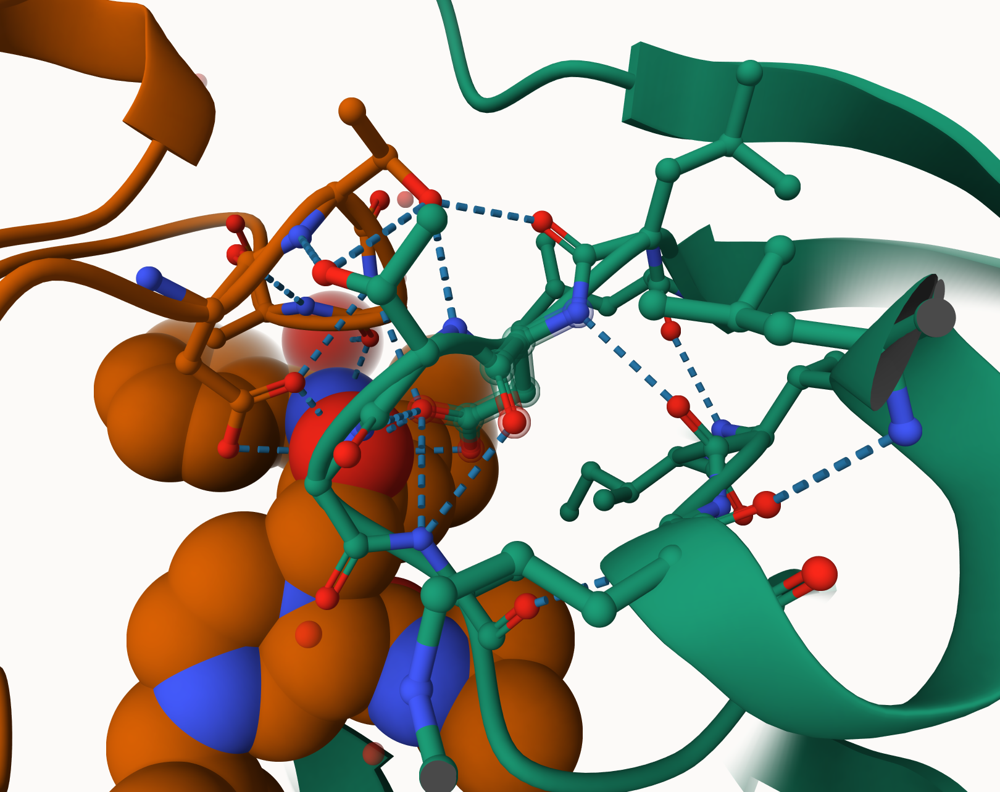
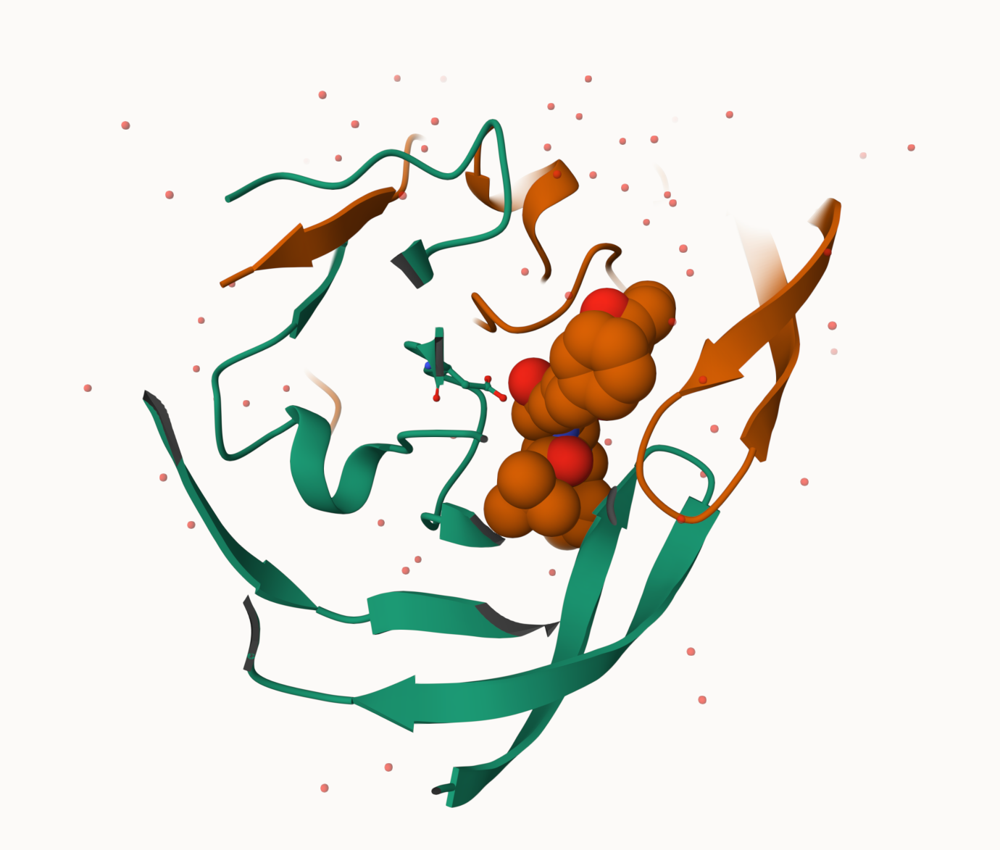

## Structural Bioinformatics (Part 1)

#PDB Statistics

```{r}
library(readr)
library(dplyr)
pdb <- read_csv("pdb_stats.csv")
pdb
```

> Q1. What percentage of structures in the PDB are solved by X-Ray and Electron Microscopy.

```{r}
total_structures <- sum(pdb$Total)
xray_pct <- 100 * sum(pdb$`X-ray`) / total_structures
em_pct   <- 100 * sum(pdb$EM) / total_structures
xray_pct
em_pct
```
80.95% of structures in the PDB are solved by X-ray, 12.84% are solved by Electron Microscopy. 

> Q2. What proportion of structures in the PDB are protein?

```{r}
protein_total <- pdb |>
  filter(grepl("Protein", `Molecular Type`)) |>
  summarise(sum_total = sum(Total)) |>
  pull(sum_total)
protein_prop <- protein_total / total_structures
protein_prop
```
97.91% of structures in the PDB are protein. 

> Q3. Type HIV in the PDB website search box on the home page and determine how many HIV-1 protease structures are in the current PDB?

There are 1,108 HIV-1 protease structures currently in the PDB.

## Visualizing the HIV-1 protease structure

>Q4. Water molecules normally have 3 atoms. Why do we see just one atom per water molecule in this structure?

We only see one atom per water molecule because in X-ray crystal structures like 1HSG, hydrogen atoms are usually not resolved. Only the oxygen atom of each water molecule is modeled and shown.

> Q5. There is a critical “conserved” water molecule in the binding site. Can you identify this water molecule? What residue number does this water molecule have

HOH 308

> Q6: Generate and save a figure clearly showing the two distinct chains of HIV-protease along with the ligand. You might also consider showing the catalytic residues ASP 25 in each chain and the critical water (we recommend “Ball & Stick” for these side-chains). Add this figure to your Quarto document. Discussion Topic: Can you think of a way in which indinavir, or even larger ligands and substrates, could enter the binding site?






The image shows the two HIV-1 protease chains, the bound ligand in the active site, the ASP 25 catalytic residues from each chain, and the conserved water molecule.


## Section 4: Introduction to Bio3D in R

```{r}
library(bio3d)
```

```{r}
library(bio3dview)
```

```{r}
pdb <- read.pdb("1hsg")
pdb
```

> Q7. How many amino acid residues are there in this pdb object? 

198

> Q8. Name one of the two non-protein residues? 

HOH

> Q9. How many protein chains are in this structure?

2

# Quick PDB visualization

**Unable to generate 3D Protein Models**

```{r}
#library(bio3dview)
#library(NGLVieweR)

#view.pdb(pdb) |>
  #setSpin()
```

```{r}
#sele <- atom.select(pdb, resno=25)

# and highlight them in spacefill representation
#view.pdb(pdb, cols=c("navy","teal"), 
         #highlight = sele,
         #highlight.style = "spacefill") |>
 # setRock()
```


## Predicting functional motions of a single structure

```{r}
adk <- read.pdb("6s36")
```

```{r}
adk
```


```{r}
#library(bio3d)
#adk <- read.pdb("6s36")
#m <- nma(adk)
#plot(m)
```


```{r}
#m <- nma(adk)
#mktrj(m, file="adk_m7.pdb")
```


```{r}
#view.nma(m, pdb=adk)

```


## Section 5:  Comparative structure analysis of Adenylate Kinase

> Q10. Which of the packages above is found only on BioConductor and not CRAN? 

Msa

> Q11. Which of the above packages is not found on BioConductor or CRAN?: 

Bio3dview

> Q12. True or False? Functions from the pak package can be used to install packages from GitHub and BitBucket? 

TRUE

```{r}
#library(bio3d)
#aa <- get.seq("1ake_A")
#aa
```

> Q13. How many amino acids are in this sequence, i.e. how long is this sequence? 

214

```{r}
#hits <- NULL
#hits$pdb.id <- c('1AKE_A','6S36_A','6RZE_A','3HPR_A','1E4V_A','5EJE_A','1E4Y_A','3X2S_A','6HAP_A','6HAM_A','4K46_A','3GMT_A','4PZL_A')
```

Download releated PDB files
```{r}
#files <- get.pdb(hits$pdb.id, path="pdbs", split=TRUE, gzip=TRUE)
```

Align releated PDBs
```{r}
#pdbs <- pdbaln(files, fit = TRUE, exefile="msa")
```


```{r}
#library(bio3dview)

#view.pdbs(pdbs)
```


# Annotate
Vector containing PDB database codes
```{r}
#ids <- basename.pdb(pdbs$id)

#anno <- pdb.annotate(ids)
#unique(anno$source)
```

Perform PCA
```{r}
#pc.xray <- pca(pdbs)
#plot(pc.xray)
```


Calculate RMSD
```{r}
#rd <- rmsd(pdbs)

# Structure-based clustering
#hc.rd <- hclust(dist(rd))
#grps.rd <- cutree(hc.rd, k=3)

#plot(pc.xray, 1:2, col="grey50", bg=grps.rd, pch=21, cex=1)
```

Visualize first principal component
```{r}
#pc1 <- mktrj(pc.xray, pc=1, file="pc_1.pdb")
```

lotting results with ggplot2
```{r}
#library(ggplot2)
#library(ggrepel)

#df <- data.frame(PC1=pc.xray$z[,1], 
               #  PC2=pc.xray$z[,2], 
                # col=as.factor(grps.rd),
                # ids=ids)

#p <- ggplot(df) + 
# aes(PC1, PC2, col=col, label=ids) +
 # geom_point(size=2) +
 # geom_text_repel(max.overlaps = 20) +
  #theme(legend.position = "none")
#p
```


## Comparative protein structure analysis with PCA

We start with a database id "1ake_A"

```{r}
#library(bio3d)

#id <- "1ake_A"
#aa <- get.seq(id)
```
```{r}
#blast <- blast.pdb(aa)
```

Have a peak:
```{r}
#head(blast$hit.tbl)
```

```{r}
#hits <- plot(blast)
#hits <- NULL
#hits$pdb.id <- c('1AKE_A','6S36_A','6RZE_A','3HPR_A','1E4V_A','5EJE_A','1E4Y_A','3X2S_A','6HAP_A','6HAM_A','4K46_A','3GMT_A','4PZL_A')
```

Peak at our "top hits"

```{r}
#head(hits$pdb.id)
```

Now we can download these "top hits" these will all be ADK structures in the PDB database. 

```{r}
#files <- get.pdb(hits$pdb.id, path="pdbs", split = TRUE, gzip=TRUE)
```


We need one package from BioConductor. To set this up we need to first install a package called **BiocManager** from CRAN
Now we can use the `install()` function from this package like this: 
`BiocManager::install("msa")`

```{r}
#pdbs <- pdbaln(files, fit = TRUE, exefile="msa")
```

Let's have a little peak at our structures after "fitting" or superposing:

```{r}
#view.pdbs(pdbs,colorScheme="residue")
```

We can run functions like `rmsd()`, `rmsd()` and the best `pca()`
```{r}
#pc.xray <- pca(pdbs)
#plot(pc.xray)
```


```{r}
#plot(pc.xray, 1:2)
```


Finally, let's make a movie of the major "motion" or structural difference in the dataset - we call this a "trajectory". 

```{r}
#mktrj(pc.xray, file = "results.pdb")
```


