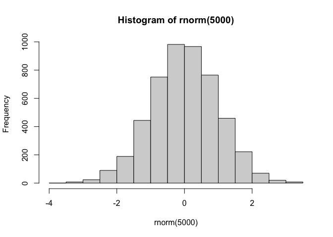
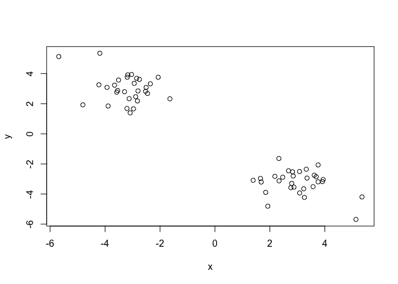
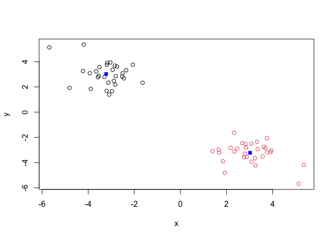
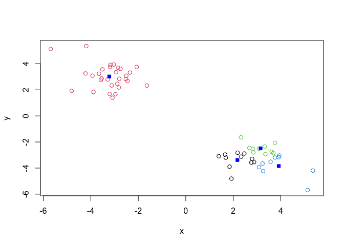
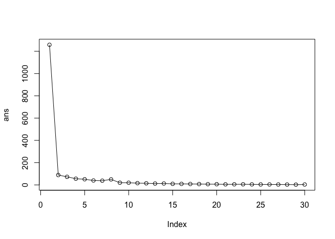
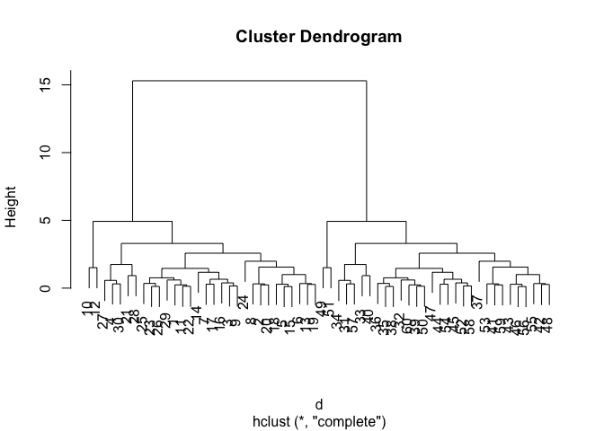
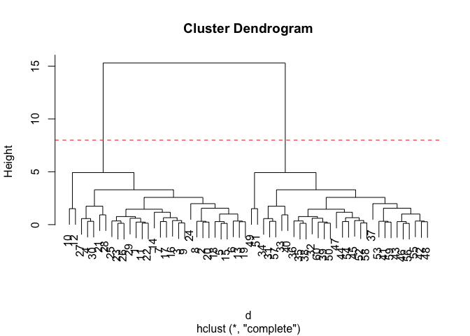
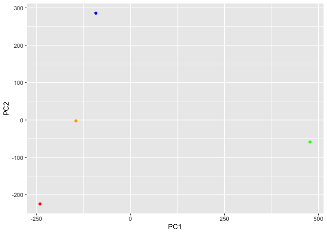
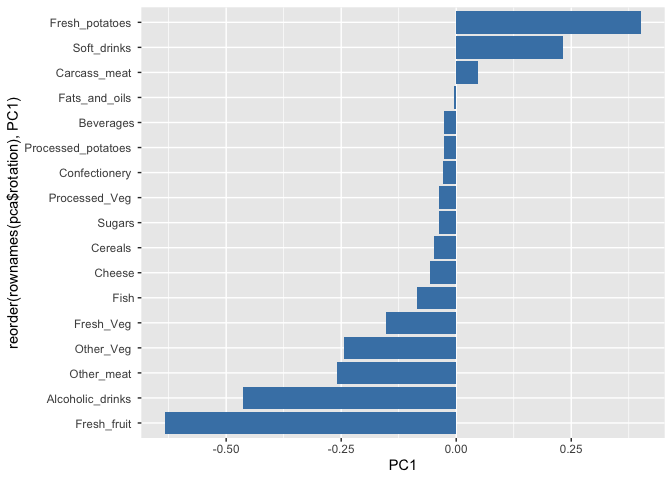

# Class 7: Machine Learning 1
Samuel Fisher (A18131929)

## Background

Today we will begin our exploration of some important machine learning
methods, namely **clustering** and **dimensionality reduction**.

Let’s make up some input data where for clustering where we know what
the natural “clusters” are

The function `rnorm()` can be useful here

``` r
hist(rnorm(5000)) 
```



> Q. Generate random numbers centered at +3

``` r
tmp <- c(rnorm(30, mean=3),
         rnorm(30, mean=-3))

x <- cbind(x=tmp, y=rev(tmp))
plot(x)
```



## K-means clustering

The main function in “Base R” for K-means clustering is called
`kmeans()`

``` r
km <- kmeans(x, centers = 2)
km
```

    K-means clustering with 2 clusters of sizes 30, 30

    Cluster means:
              x         y
    1 -3.222201  3.021572
    2  3.021572 -3.222201

    Clustering vector:
     [1] 2 2 2 2 2 2 2 2 2 2 2 2 2 2 2 2 2 2 2 2 2 2 2 2 2 2 2 2 2 2 1 1 1 1 1 1 1 1
    [39] 1 1 1 1 1 1 1 1 1 1 1 1 1 1 1 1 1 1 1 1 1 1

    Within cluster sum of squares by cluster:
    [1] 44.38802 44.38802
     (between_SS / total_SS =  92.9 %)

    Available components:

    [1] "cluster"      "centers"      "totss"        "withinss"     "tot.withinss"
    [6] "betweenss"    "size"         "iter"         "ifault"      

> Q. What component of the results object details the cluster sizes?

``` r
km$size
```

    [1] 30 30

> Q. What component of the results object details the cluster centers?

``` r
km$center
```

              x         y
    1 -3.222201  3.021572
    2  3.021572 -3.222201

> Q. What component of the results object detrails the cluster
> membership vector (i.e. our main result of which points lie in which
> cluster)?

``` r
km$cluster
```

     [1] 2 2 2 2 2 2 2 2 2 2 2 2 2 2 2 2 2 2 2 2 2 2 2 2 2 2 2 2 2 2 1 1 1 1 1 1 1 1
    [39] 1 1 1 1 1 1 1 1 1 1 1 1 1 1 1 1 1 1 1 1 1 1

> Q. Plot our clustering results with points colored by cluster and also
> add the cluster centers as new points colored blue

``` r
plot(x, col=km$cluster)
points(km$centers, col ="blue", pch=15)
```



> Q. Run `kmeans()` again and this time produce 4 clusters (and call
> your result object `k4`) and make a results figure like above?

``` r
k4 <- kmeans(x, 4)
plot(x, col=k4$cluster)
points(k4$centers, col ="blue", pch=15)
```



The metric

``` r
km$tot.withinss
```

    [1] 88.77605

``` r
k4$tot.withinss
```

    [1] 64.38972

> Q. Let’s try different number of K (centers) from 1 to 30 and see what
> the best result is

``` r
ans <- NULL
for(i in 1:30) {
  ans <- c( ans, kmeans(x, centers = i)$tot.withinss)
}

ans
```

     [1] 1258.317095   88.776049   72.704168   55.820340   50.876832   39.764682
     [7]   37.921670   49.592735   19.964126   19.679560   15.975302   14.457537
    [13]   12.332026   12.741378    9.883549    9.365309    8.389668    7.671694
    [19]    6.784571    6.397302    5.099515    5.430615    5.664663    4.826897
    [25]    4.197870    4.197149    3.718268    3.290567    2.419049    3.714283

``` r
plot(ans, typ="o")
```



**Key-point** K-means will impose a clustering structure on your data
even if it is not there - it will always give you the answer you asked
for even if that answer is silly!

## Hierarchial Clustering

The main function for Hierarchial Clustering is called `hclust()` Unline
`kmeans()` (which does all the work for you) you can’t just pass
`hclust()` our raw input data. It needs a “distance matrix” like the one
returned from the `dist()` function.

``` r
d <- dist(x)
hc <- hclust(d)
plot(hc)
```



To extract our cluster membership vector from a `hclust()` result object
we have to “cut” our tree at a given height to yield separate
“groups”/“branches”.

``` r
plot(hc)
abline(h=8, col="red", lty=2)
```



To do this we use the `cutree()` function on our `hclust()` object:

``` r
grps <- cutree(hc, h=8)
grps
```

     [1] 1 1 1 1 1 1 1 1 1 1 1 1 1 1 1 1 1 1 1 1 1 1 1 1 1 1 1 1 1 1 2 2 2 2 2 2 2 2
    [39] 2 2 2 2 2 2 2 2 2 2 2 2 2 2 2 2 2 2 2 2 2 2

``` r
table(grps, km$cluster)
```

        
    grps  1  2
       1  0 30
       2 30  0

## PCA of UK food Data

Import the dataset of food consumption in the UK:

``` r
url <- "https://tinyurl.com/UK-foods"
x <- read.csv(url)
x
```

                         X England Wales Scotland N.Ireland
    1               Cheese     105   103      103        66
    2        Carcass_meat      245   227      242       267
    3          Other_meat      685   803      750       586
    4                 Fish     147   160      122        93
    5       Fats_and_oils      193   235      184       209
    6               Sugars     156   175      147       139
    7      Fresh_potatoes      720   874      566      1033
    8           Fresh_Veg      253   265      171       143
    9           Other_Veg      488   570      418       355
    10 Processed_potatoes      198   203      220       187
    11      Processed_Veg      360   365      337       334
    12        Fresh_fruit     1102  1137      957       674
    13            Cereals     1472  1582     1462      1494
    14           Beverages      57    73       53        47
    15        Soft_drinks     1374  1256     1572      1506
    16   Alcoholic_drinks      375   475      458       135
    17      Confectionery       54    64       62        41

> Q. How many rows and columns are in your new data frame named x: What
> R functions could you use to answer this?

``` r
dim(x)
```

    [1] 17  5

One solution to set the row names is to do it by hand…

``` r
rownames(x) <- x[,1]
```

To remove the first column I can use the minus index trick

``` r
x<- x[,-1]
```

A better way to do thids is to set the row names to the first column
with `read,csv()`

``` r
x <- read.csv(url, row.names = 1)
x
```

                        England Wales Scotland N.Ireland
    Cheese                  105   103      103        66
    Carcass_meat            245   227      242       267
    Other_meat              685   803      750       586
    Fish                    147   160      122        93
    Fats_and_oils           193   235      184       209
    Sugars                  156   175      147       139
    Fresh_potatoes          720   874      566      1033
    Fresh_Veg               253   265      171       143
    Other_Veg               488   570      418       355
    Processed_potatoes      198   203      220       187
    Processed_Veg           360   365      337       334
    Fresh_fruit            1102  1137      957       674
    Cereals                1472  1582     1462      1494
    Beverages                57    73       53        47
    Soft_drinks            1374  1256     1572      1506
    Alcoholic_drinks        375   475      458       135
    Confectionery            54    64       62        41

### Spotting major differences and trends

Is difficult even in this wee 17D dataset…

``` r
barplot(as.matrix(x), beside=T, col=rainbow(nrow(x)))
```


``` r
barplot(as.matrix(x), beside=F, col=rainbow(nrow(x)))
```


### Pairs plots and heatmaps

``` r
pairs(x, col=rainbow(nrow(x)), pch=16)
```


``` r
library(pheatmap)

pheatmap(as.matrix(x))
```


## PCA to the rescue

The main PCA function in “base R”

``` r
pca <- prcomp(t(x))
```

``` r
summary(pca)
```

    Importance of components:
                                PC1      PC2      PC3     PC4
    Standard deviation     324.1502 212.7478 73.87622 2.7e-14
    Proportion of Variance   0.6744   0.2905  0.03503 0.0e+00
    Cumulative Proportion    0.6744   0.9650  1.00000 1.0e+00

``` r
attributes(pca)
```

    $names
    [1] "sdev"     "rotation" "center"   "scale"    "x"       

    $class
    [1] "prcomp"

To make one of main PCA result figure we turn to `pca$x` the scores
along our new PCs. This is called “PC Plot” or “Score Plot” or
“Ordination Plot”, etc.

``` r
my_cols <- c("orange", "red", "blue", "green")
```

``` r
library(ggplot2)

ggplot(pca$x) +
  aes(PC1, PC2) + 
  geom_point(col= my_cols)
```



The second major result figure is called a “loadings plot” of “variable
contributions plot” or “weight plot”

``` r
ggplot(pca$rotation) + 
  aes(x= PC1, y= reorder(rownames(pca$rotation), PC1)) +
  geom_col(fill = "steelblue")
```


