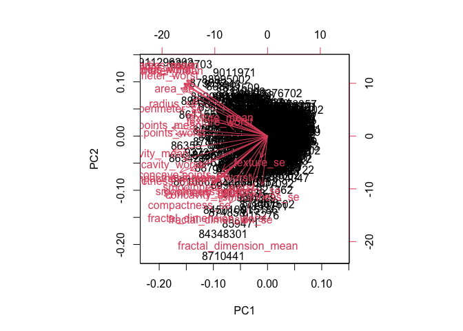
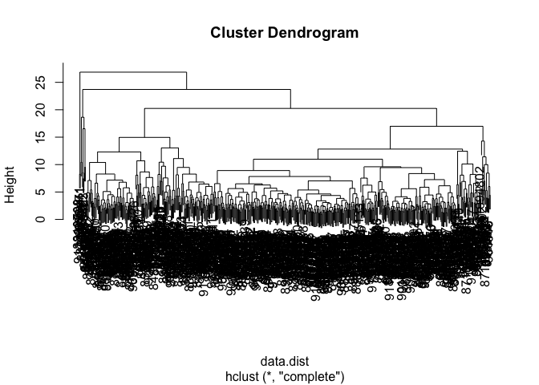
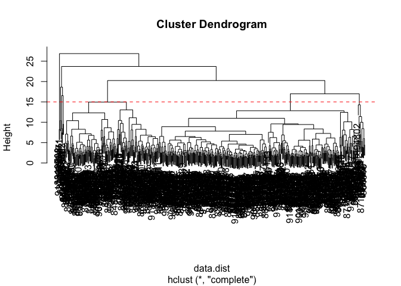
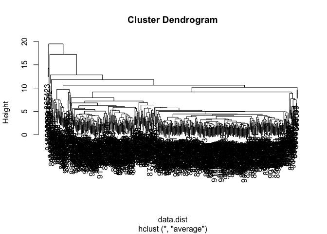
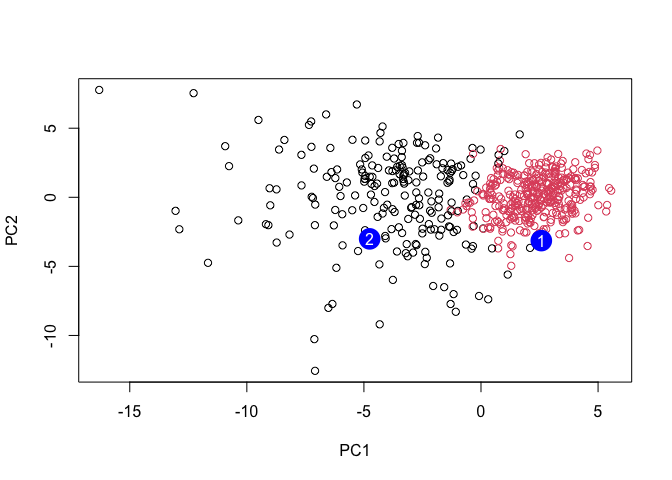

# Class08
Samuel Fisher (A18131929)

# Save your input data file into your Project directory

fna.data \<- “WisconsinCancer.csv”

# Complete the following code to input the data and store as wisc.df

wisc.df \<- \_\_\_(fna.data, row.names=1)

## Exploratory Data Analysis

First we load the Wisconsin cancer dataset and prepare it for analysis.

``` r
fna.data <- "WisconsinCancer.csv"
wisc.df <- read.csv(fna.data, row.names=1)
head(wisc.df, 4)
```

             diagnosis radius_mean texture_mean perimeter_mean area_mean
    842302           M       17.99        10.38         122.80    1001.0
    842517           M       20.57        17.77         132.90    1326.0
    84300903         M       19.69        21.25         130.00    1203.0
    84348301         M       11.42        20.38          77.58     386.1
             smoothness_mean compactness_mean concavity_mean concave.points_mean
    842302           0.11840          0.27760         0.3001             0.14710
    842517           0.08474          0.07864         0.0869             0.07017
    84300903         0.10960          0.15990         0.1974             0.12790
    84348301         0.14250          0.28390         0.2414             0.10520
             symmetry_mean fractal_dimension_mean radius_se texture_se perimeter_se
    842302          0.2419                0.07871    1.0950     0.9053        8.589
    842517          0.1812                0.05667    0.5435     0.7339        3.398
    84300903        0.2069                0.05999    0.7456     0.7869        4.585
    84348301        0.2597                0.09744    0.4956     1.1560        3.445
             area_se smoothness_se compactness_se concavity_se concave.points_se
    842302    153.40      0.006399        0.04904      0.05373           0.01587
    842517     74.08      0.005225        0.01308      0.01860           0.01340
    84300903   94.03      0.006150        0.04006      0.03832           0.02058
    84348301   27.23      0.009110        0.07458      0.05661           0.01867
             symmetry_se fractal_dimension_se radius_worst texture_worst
    842302       0.03003             0.006193        25.38         17.33
    842517       0.01389             0.003532        24.99         23.41
    84300903     0.02250             0.004571        23.57         25.53
    84348301     0.05963             0.009208        14.91         26.50
             perimeter_worst area_worst smoothness_worst compactness_worst
    842302            184.60     2019.0           0.1622            0.6656
    842517            158.80     1956.0           0.1238            0.1866
    84300903          152.50     1709.0           0.1444            0.4245
    84348301           98.87      567.7           0.2098            0.8663
             concavity_worst concave.points_worst symmetry_worst
    842302            0.7119               0.2654         0.4601
    842517            0.2416               0.1860         0.2750
    84300903          0.4504               0.2430         0.3613
    84348301          0.6869               0.2575         0.6638
             fractal_dimension_worst
    842302                   0.11890
    842517                   0.08902
    84300903                 0.08758
    84348301                 0.17300

We remove the diagnosis column so unsupervised methods do not use the
known labels.

``` r
wisc.data <- wisc.df[, -1]
```

## Diagnosis Vector

We save the diagnosis column as a factor for later comparison and
plotting.

``` r
diagnosis <- as.factor(wisc.df$diagnosis)
```

## Q1 - Number of observations

We check how many observations (rows) are in the dataset.

``` r
nrow(wisc.data)
```

    [1] 569

There are 569 observations in the dataset

## Q2 - Number of malignant samples

We want to count how many samples are labeled malignant in the diagnosis
vector.

``` r
table(diagnosis)
```

    diagnosis
      B   M 
    357 212 

212 observations are malignant

## Q3 - Number of \_mean features

We want to count how many variable names end with \_mean.

``` r
length(grep("_mean$", colnames(wisc.data)))
```

    [1] 10

10 variables names end with \_mean

## Principal Component Analysis

# Check column means and standard deviations

``` r
colMeans(wisc.data)
```

                radius_mean            texture_mean          perimeter_mean 
               1.412729e+01            1.928965e+01            9.196903e+01 
                  area_mean         smoothness_mean        compactness_mean 
               6.548891e+02            9.636028e-02            1.043410e-01 
             concavity_mean     concave.points_mean           symmetry_mean 
               8.879932e-02            4.891915e-02            1.811619e-01 
     fractal_dimension_mean               radius_se              texture_se 
               6.279761e-02            4.051721e-01            1.216853e+00 
               perimeter_se                 area_se           smoothness_se 
               2.866059e+00            4.033708e+01            7.040979e-03 
             compactness_se            concavity_se       concave.points_se 
               2.547814e-02            3.189372e-02            1.179614e-02 
                symmetry_se    fractal_dimension_se            radius_worst 
               2.054230e-02            3.794904e-03            1.626919e+01 
              texture_worst         perimeter_worst              area_worst 
               2.567722e+01            1.072612e+02            8.805831e+02 
           smoothness_worst       compactness_worst         concavity_worst 
               1.323686e-01            2.542650e-01            2.721885e-01 
       concave.points_worst          symmetry_worst fractal_dimension_worst 
               1.146062e-01            2.900756e-01            8.394582e-02 

``` r
apply(wisc.data, 2, sd)
```

                radius_mean            texture_mean          perimeter_mean 
               3.524049e+00            4.301036e+00            2.429898e+01 
                  area_mean         smoothness_mean        compactness_mean 
               3.519141e+02            1.406413e-02            5.281276e-02 
             concavity_mean     concave.points_mean           symmetry_mean 
               7.971981e-02            3.880284e-02            2.741428e-02 
     fractal_dimension_mean               radius_se              texture_se 
               7.060363e-03            2.773127e-01            5.516484e-01 
               perimeter_se                 area_se           smoothness_se 
               2.021855e+00            4.549101e+01            3.002518e-03 
             compactness_se            concavity_se       concave.points_se 
               1.790818e-02            3.018606e-02            6.170285e-03 
                symmetry_se    fractal_dimension_se            radius_worst 
               8.266372e-03            2.646071e-03            4.833242e+00 
              texture_worst         perimeter_worst              area_worst 
               6.146258e+00            3.360254e+01            5.693570e+02 
           smoothness_worst       compactness_worst         concavity_worst 
               2.283243e-02            1.573365e-01            2.086243e-01 
       concave.points_worst          symmetry_worst fractal_dimension_worst 
               6.573234e-02            6.186747e-02            1.806127e-02 

The variables have very different standard deviations, so scaling is
required before performing PCA.

## PCA Model

# Perform PCA on wisc.data by completing the following code

``` r
wisc.pr <- prcomp(wisc.data, scale = TRUE)
```

We want to look over the PCA summary to see how much variance of each
principal component

``` r
summary(wisc.pr)
```

    Importance of components:
                              PC1    PC2     PC3     PC4     PC5     PC6     PC7
    Standard deviation     3.6444 2.3857 1.67867 1.40735 1.28403 1.09880 0.82172
    Proportion of Variance 0.4427 0.1897 0.09393 0.06602 0.05496 0.04025 0.02251
    Cumulative Proportion  0.4427 0.6324 0.72636 0.79239 0.84734 0.88759 0.91010
                               PC8    PC9    PC10   PC11    PC12    PC13    PC14
    Standard deviation     0.69037 0.6457 0.59219 0.5421 0.51104 0.49128 0.39624
    Proportion of Variance 0.01589 0.0139 0.01169 0.0098 0.00871 0.00805 0.00523
    Cumulative Proportion  0.92598 0.9399 0.95157 0.9614 0.97007 0.97812 0.98335
                              PC15    PC16    PC17    PC18    PC19    PC20   PC21
    Standard deviation     0.30681 0.28260 0.24372 0.22939 0.22244 0.17652 0.1731
    Proportion of Variance 0.00314 0.00266 0.00198 0.00175 0.00165 0.00104 0.0010
    Cumulative Proportion  0.98649 0.98915 0.99113 0.99288 0.99453 0.99557 0.9966
                              PC22    PC23   PC24    PC25    PC26    PC27    PC28
    Standard deviation     0.16565 0.15602 0.1344 0.12442 0.09043 0.08307 0.03987
    Proportion of Variance 0.00091 0.00081 0.0006 0.00052 0.00027 0.00023 0.00005
    Cumulative Proportion  0.99749 0.99830 0.9989 0.99942 0.99969 0.99992 0.99997
                              PC29    PC30
    Standard deviation     0.02736 0.01153
    Proportion of Variance 0.00002 0.00000
    Cumulative Proportion  1.00000 1.00000

## Q4 - Variance found by PC1

Proportion of Variance — PC1 = 0.4427, therefore PC1 captures 44.27% of
the total variance.

## Q5 - PCs needed for 70% variance

PC1 = 0.4427 PC2 = 0.6324 PC3 = 0.72636 ← first value greater than or
equal to 0.70

Three principal components are needed to explain at least 70% of the
variance.

## Q6 - PCs needed for 90% variance

PC6 = 0.88759 PC7 = 0.91010 ← first value greater than or equal to 0.90
Seven principal components are needed to explain at least 90% of the
variance.

## Interpreting PCA Results

We want to create a PCA biplot to visualize both sample scores and
feature loadings.

``` r
biplot(wisc.pr)
```



## Q7 - Biplot Interpretation

The biplot is incredibly difficult to interpret because it is chaotic
and with many things overlapping. The row labels are all over the
figure, making patterns and group separation hard to see and understand.

## PC1 vs PC2 Plot

Scatter plot observations by components 1 and 2

``` r
library(ggplot2)
ggplot(wisc.pr$x) +
  aes(PC1, PC2, col = diagnosis) +
  geom_point()
```


## Q8 - Compare plots of PC1 vs PC2 to plot of PC1 vs PC3

``` r
ggplot(wisc.pr$x) +
  aes(PC1, PC3, col = diagnosis) +
  geom_point()
```


# PC1 vs PC3 Plot

The PC1 vs PC2 plot has a clearer separation between M and B samples
than the PC1 vs PC3 plot. This shows that PC2 captures more
class-separating structure than PC3. PC1 seems to drive most of the
separation overall, while later components add less discriminatory
power.

## Variance Explained

# Calculate variance of each component

``` r
pr.var <- wisc.pr$sdev^2
head(pr.var)
```

    [1] 13.281608  5.691355  2.817949  1.980640  1.648731  1.207357

``` r
pve <- pr.var / sum(pr.var)
plot(c(1,pve), xlab = "Principal Component",
ylab = "Proportion of Variance Explained",
ylim = c(0, 1), type = "o")
```


# Alternative scree plot of the same data, note data driven y-axis

``` r
barplot(pve, ylab = "Percent of Variance Explained",
names.arg=paste0("PC",1:length(pve)), las=2, axes = FALSE)
axis(2, at=pve, labels=round(pve,2)*100 )
```


## Q9 — Plot Interpretation

``` r
wisc.pr$rotation["concave.points_mean", 1]
```

    [1] -0.2608538

``` r
sort(wisc.pr$rotation[,1], decreasing=TRUE)[1:5]
```

             smoothness_se             texture_se            symmetry_se 
               -0.01453145            -0.01742803            -0.04249842 
    fractal_dimension_mean   fractal_dimension_se 
               -0.06436335            -0.10256832 

``` r
sort(abs(wisc.pr$rotation[,1]), decreasing=TRUE)[1:5]
```

     concave.points_mean       concavity_mean concave.points_worst 
               0.2608538            0.2584005            0.2508860 
        compactness_mean      perimeter_worst 
               0.2392854            0.2366397 

The loading value for concave.points_mean in PC1 is 0.2608538. There are
no features with a larger absolute loading than this one. It is the
largest contributor to PC1 (with concavity_mean and concave.points_worst
being slightly smaller but similar).

## Hierarchical Clustering

``` r
data.scaled <- scale(wisc.data)
data.dist <- dist(data.scaled)
```

Perform hierarchical clustering using complete linkage and plot

``` r
wisc.hclust <- hclust(data.dist, method = "complete")
plot(wisc.hclust)
```



## Q10

``` r
plot(wisc.hclust)
abline(h = 15, col="red", lty=2)
```



The height at which the clustering model has 4 clusters is approximately
15.

``` r
wisc.clusters <- cutree(wisc.hclust, k = 4)
```

``` r
table(wisc.clusters, diagnosis)
```

                 diagnosis
    wisc.clusters   B   M
                1  12 165
                2   2   5
                3 343  40
                4   0   2

## Q12

Ward.D2 gives the best results because it creates the cleanest and most
balanced cluster separation while minimizing cluster variance within,
which fits this dataset well.

## Clustering on PCA Results

We will do the hierarchical clustering again but using average linkage
to compare results.

``` r
wisc.hclust.avg <- hclust(data.dist, method = "average")
plot(wisc.hclust.avg)
```



``` r
wisc.clusters.avg <- cutree(wisc.hclust.avg, k = 2)
table(wisc.clusters.avg, diagnosis)
```

                     diagnosis
    wisc.clusters.avg   B   M
                    1 357 209
                    2   0   3

## Average Linkage Cluster Comparison

Using average linkage makes a similar result to complete linkage. The
clusters still don’t align perfectly with diagnosis labels. This shows
that hierarchical clustering w/o labels doesn’t perfectly separate B and
M samples.

## Clustering on PCA Scores

# Hierarchical clustering on PCA scores (first 7 PCs)

``` r
pc.dist <- dist(wisc.pr$x[,1:7])
wisc.pr.hclust <- hclust(dist(wisc.pr$x[,1:7]), method = "ward.D2")
plot(wisc.pr.hclust)
```


``` r
grps <- cutree(wisc.pr.hclust, k=2)
table(grps)
```

    grps
      1   2 
    216 353 

``` r
table(grps, diagnosis)
```

        diagnosis
    grps   B   M
       1  28 188
       2 329  24

``` r
ggplot(wisc.pr$x) +
aes(PC1, PC2) +
geom_point(col=grps)
```


## Use the distance along the first 7 PCs for clustering i.e. wisc.pr\$x\[, 1:7\]

``` r
wisc.pr.hclust <- hclust(dist(wisc.pr$x[,1:7]), method="ward.D2")
```

``` r
wisc.pr.hclust.clusters <- cutree(wisc.pr.hclust, k=2)
```

## Q13

# Compare to actual diagnoses

``` r
table(wisc.pr.hclust.clusters, diagnosis)
```

                           diagnosis
    wisc.pr.hclust.clusters   B   M
                          1  28 188
                          2 329  24

It separates pretty well, with 52 total misclassified. 28 Benign mixed
into the mostly malignant cluster plus 24 malignant mixed into the
mostly-benign cluster.

## Q14

``` r
table(wisc.clusters, diagnosis)
```

                 diagnosis
    wisc.clusters   B   M
                1  12 165
                2   2   5
                3 343  40
                4   0   2

Clustering on the PCA transformed data separates the diagnoses better
than clustering on the original features. The PCA based model generates
two better clusters that have less mixed benign/malignant cases. The
original data clustering spreads samples across more mixed clusters.

### Prediction

``` r
#url <- "new_samples.csv"
url <- "https://tinyurl.com/new-samples-CSV"
new <- read.csv(url)
npc <- predict(wisc.pr, newdata=new)
npc
```

               PC1       PC2        PC3        PC4       PC5        PC6        PC7
    [1,]  2.576616 -3.135913  1.3990492 -0.7631950  2.781648 -0.8150185 -0.3959098
    [2,] -4.754928 -3.009033 -0.1660946 -0.6052952 -1.140698 -1.2189945  0.8193031
                PC8       PC9       PC10      PC11      PC12      PC13     PC14
    [1,] -0.2307350 0.1029569 -0.9272861 0.3411457  0.375921 0.1610764 1.187882
    [2,] -0.3307423 0.5281896 -0.4855301 0.7173233 -1.185917 0.5893856 0.303029
              PC15       PC16        PC17        PC18        PC19       PC20
    [1,] 0.3216974 -0.1743616 -0.07875393 -0.11207028 -0.08802955 -0.2495216
    [2,] 0.1299153  0.1448061 -0.40509706  0.06565549  0.25591230 -0.4289500
               PC21       PC22       PC23       PC24        PC25         PC26
    [1,]  0.1228233 0.09358453 0.08347651  0.1223396  0.02124121  0.078884581
    [2,] -0.1224776 0.01732146 0.06316631 -0.2338618 -0.20755948 -0.009833238
                 PC27        PC28         PC29         PC30
    [1,]  0.220199544 -0.02946023 -0.015620933  0.005269029
    [2,] -0.001134152  0.09638361  0.002795349 -0.019015820

``` r
plot(wisc.pr$x[,1:2], col=grps)
points(npc[,1], npc[,2], col="blue", pch=16, cex=3)
text(npc[,1], npc[,2], c(1,2), col="white")
```



## Q16

Patient 1 should be prioritized for a follow up because it falls within
the malignant like cluster.Patient 2 groups with the benign like
cluster.
