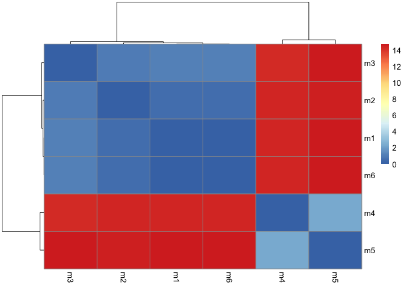
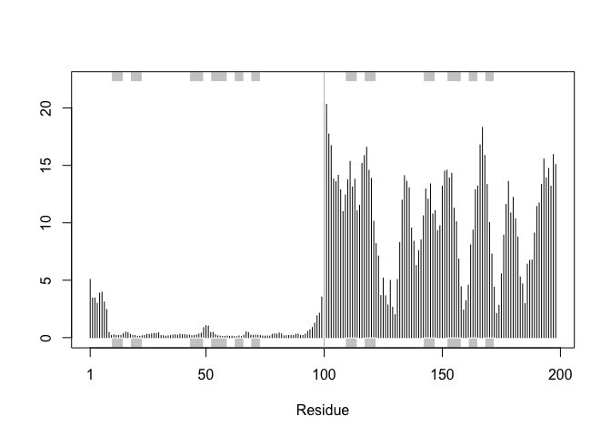
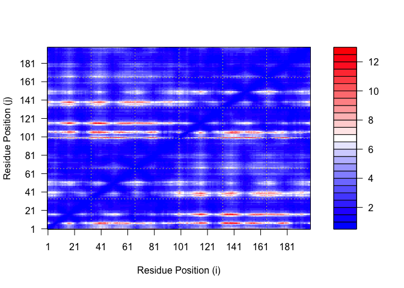
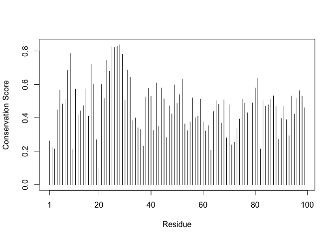

# Class11: AlphaFold
Samuel Fisher (A18131929)

## Background

In this hands-on session we will utilize AlphaFold to predict protein
structure from sequence (Jumper et al. 2021). Without the aid of such
approaches, it can take years of expensive laboratory work to determine
the structure of just one protein. With AlphaFold we can now accurately
compute a typical protein structure in as little as ten minutes. The PDB
database(the main repositry of experimental structures) only has
approximately 250 thousand structures (we saw this in the last lab). The
main protein sequence database has over **200 million** sequences! Only
0.125% of known sequences have a known structure - this is called the
“structure knowledge gap”.

``` r
(250000 / 200000000) * 100
```

    [1] 0.125

Structures are much harder to determine than sequences They are
expensive (on average ~\$1 million each) They take on average 3-5 years
to solve!

# EBI AlphaFold Database

The EBI has a database of pre-computed AlphaFold (AF) models called
AFDB. This is growing all the time and can be useful to check before
running AF ourselves.

## Running AlphaFold

We can download and run locally (on our own computers) but we need a
GPU. Or we can use “cloud” computing to run this on somene else’s
computer

We will use ColabFold \< https://github.com/sokrypton/ColabFold

We previously found there was no AFDB entry for our HIV sequence.

    >HIV-Pr-Dimer
    PQITLWQRPLVTIKIGGQLKEALLDTGADDTVLEEMSLPGRWKPKMIGGIGGFIKVRQYDQILIEICGHKAIGTVLVGPTPVNIIGRNLLTQIGCTLNF:PQITLWQRPLVTIKIGGQLKEALLDTGADDTVLEEMSLPGRWKPKMIGGIGGFIKVRQYDQILIEICGHKAIGTVLVGPTPVNIIGRNLLTQIGCTLNF

Here we will use AlphaFold2_mmseqs2

I was unable to use Mol\* to generate the image frm section 7. I was
able to view the proteins, but unable to select the individual proteins
in order to superimpose them.

## Section 8

# Section 8: point to YOUR results folder (must contain the 5 .pdb files)

``` r
results_dir <- "hivpr_23119/"
```

``` r
## list all PDB models in current project folder
pdb_files <- list.files(pattern="\\.pdb$", full.names=TRUE)

basename(pdb_files)
```

    [1] "hivpr_23119_unrelaxed_rank_001_alphafold2_multimer_v3_model_4_seed_000.pdb"
    [2] "hivpr_23119_unrelaxed_rank_002_alphafold2_multimer_v3_model_1_seed_000.pdb"
    [3] "hivpr_23119_unrelaxed_rank_003_alphafold2_multimer_v3_model_5_seed_000.pdb"
    [4] "hivpr_23119_unrelaxed_rank_004_alphafold2_multimer_v3_model_2_seed_000.pdb"
    [5] "hivpr_23119_unrelaxed_rank_005_alphafold2_multimer_v3_model_3_seed_000.pdb"
    [6] "m1_conserv.pdb"                                                            

``` r
library(bio3d)

# Read all PDB models and superpose/fit coordinates
pdbs <- pdbaln(pdb_files, fit=TRUE, exefile="msa")
```

    Reading PDB files:
    ./hivpr_23119_unrelaxed_rank_001_alphafold2_multimer_v3_model_4_seed_000.pdb
    ./hivpr_23119_unrelaxed_rank_002_alphafold2_multimer_v3_model_1_seed_000.pdb
    ./hivpr_23119_unrelaxed_rank_003_alphafold2_multimer_v3_model_5_seed_000.pdb
    ./hivpr_23119_unrelaxed_rank_004_alphafold2_multimer_v3_model_2_seed_000.pdb
    ./hivpr_23119_unrelaxed_rank_005_alphafold2_multimer_v3_model_3_seed_000.pdb
    ./m1_conserv.pdb
    ......

    Extracting sequences

    pdb/seq: 1   name: ./hivpr_23119_unrelaxed_rank_001_alphafold2_multimer_v3_model_4_seed_000.pdb 
    pdb/seq: 2   name: ./hivpr_23119_unrelaxed_rank_002_alphafold2_multimer_v3_model_1_seed_000.pdb 
    pdb/seq: 3   name: ./hivpr_23119_unrelaxed_rank_003_alphafold2_multimer_v3_model_5_seed_000.pdb 
    pdb/seq: 4   name: ./hivpr_23119_unrelaxed_rank_004_alphafold2_multimer_v3_model_2_seed_000.pdb 
    pdb/seq: 5   name: ./hivpr_23119_unrelaxed_rank_005_alphafold2_multimer_v3_model_3_seed_000.pdb 
    pdb/seq: 6   name: ./m1_conserv.pdb 

``` r
pdbs
```

                                   1        .         .         .         .         50 
    [Truncated_Name:1]hivpr_2311   PQITLWQRPLVTIKIGGQLKEALLDTGADDTVLEEMSLPGRWKPKMIGGI
    [Truncated_Name:2]hivpr_2311   PQITLWQRPLVTIKIGGQLKEALLDTGADDTVLEEMSLPGRWKPKMIGGI
    [Truncated_Name:3]hivpr_2311   PQITLWQRPLVTIKIGGQLKEALLDTGADDTVLEEMSLPGRWKPKMIGGI
    [Truncated_Name:4]hivpr_2311   PQITLWQRPLVTIKIGGQLKEALLDTGADDTVLEEMSLPGRWKPKMIGGI
    [Truncated_Name:5]hivpr_2311   PQITLWQRPLVTIKIGGQLKEALLDTGADDTVLEEMSLPGRWKPKMIGGI
    [Truncated_Name:6]m1_conserv   PQITLWQRPLVTIKIGGQLKEALLDTGADDTVLEEMSLPGRWKPKMIGGI
                                   ************************************************** 
                                   1        .         .         .         .         50 

                                  51        .         .         .         .         100 
    [Truncated_Name:1]hivpr_2311   GGFIKVRQYDQILIEICGHKAIGTVLVGPTPVNIIGRNLLTQIGCTLNFP
    [Truncated_Name:2]hivpr_2311   GGFIKVRQYDQILIEICGHKAIGTVLVGPTPVNIIGRNLLTQIGCTLNFP
    [Truncated_Name:3]hivpr_2311   GGFIKVRQYDQILIEICGHKAIGTVLVGPTPVNIIGRNLLTQIGCTLNFP
    [Truncated_Name:4]hivpr_2311   GGFIKVRQYDQILIEICGHKAIGTVLVGPTPVNIIGRNLLTQIGCTLNFP
    [Truncated_Name:5]hivpr_2311   GGFIKVRQYDQILIEICGHKAIGTVLVGPTPVNIIGRNLLTQIGCTLNFP
    [Truncated_Name:6]m1_conserv   GGFIKVRQYDQILIEICGHKAIGTVLVGPTPVNIIGRNLLTQIGCTLNFP
                                   ************************************************** 
                                  51        .         .         .         .         100 

                                 101        .         .         .         .         150 
    [Truncated_Name:1]hivpr_2311   QITLWQRPLVTIKIGGQLKEALLDTGADDTVLEEMSLPGRWKPKMIGGIG
    [Truncated_Name:2]hivpr_2311   QITLWQRPLVTIKIGGQLKEALLDTGADDTVLEEMSLPGRWKPKMIGGIG
    [Truncated_Name:3]hivpr_2311   QITLWQRPLVTIKIGGQLKEALLDTGADDTVLEEMSLPGRWKPKMIGGIG
    [Truncated_Name:4]hivpr_2311   QITLWQRPLVTIKIGGQLKEALLDTGADDTVLEEMSLPGRWKPKMIGGIG
    [Truncated_Name:5]hivpr_2311   QITLWQRPLVTIKIGGQLKEALLDTGADDTVLEEMSLPGRWKPKMIGGIG
    [Truncated_Name:6]m1_conserv   QITLWQRPLVTIKIGGQLKEALLDTGADDTVLEEMSLPGRWKPKMIGGIG
                                   ************************************************** 
                                 101        .         .         .         .         150 

                                 151        .         .         .         .       198 
    [Truncated_Name:1]hivpr_2311   GFIKVRQYDQILIEICGHKAIGTVLVGPTPVNIIGRNLLTQIGCTLNF
    [Truncated_Name:2]hivpr_2311   GFIKVRQYDQILIEICGHKAIGTVLVGPTPVNIIGRNLLTQIGCTLNF
    [Truncated_Name:3]hivpr_2311   GFIKVRQYDQILIEICGHKAIGTVLVGPTPVNIIGRNLLTQIGCTLNF
    [Truncated_Name:4]hivpr_2311   GFIKVRQYDQILIEICGHKAIGTVLVGPTPVNIIGRNLLTQIGCTLNF
    [Truncated_Name:5]hivpr_2311   GFIKVRQYDQILIEICGHKAIGTVLVGPTPVNIIGRNLLTQIGCTLNF
    [Truncated_Name:6]m1_conserv   GFIKVRQYDQILIEICGHKAIGTVLVGPTPVNIIGRNLLTQIGCTLNF
                                   ************************************************ 
                                 151        .         .         .         .       198 

    Call:
      pdbaln(files = pdb_files, fit = TRUE, exefile = "msa")

    Class:
      pdbs, fasta

    Alignment dimensions:
      6 sequence rows; 198 position columns (198 non-gap, 0 gap) 

    + attr: xyz, resno, b, chain, id, ali, resid, sse, call

``` r
rd <- rmsd(pdbs, fit=TRUE)
```

    Warning in rmsd(pdbs, fit = TRUE): No indices provided, using the 198 non NA positions

``` r
range(rd)
```

    [1]  0.000 14.754

``` r
library(pheatmap)
# compute RMSD matrix
rd <- rmsd(pdbs, fit = TRUE)
```

    Warning in rmsd(pdbs, fit = TRUE): No indices provided, using the 198 non NA positions

``` r
# auto-size labels to match matrix
n <- ncol(rd)
labs <- paste0("m", seq_len(n))
colnames(rd) <- labs
rownames(rd) <- labs
pheatmap(rd)
```



``` r
library(bio3d)
# Read a reference PDB for secondary structure annotation
pdb <- read.pdb("1hsg")
```

      Note: Accessing on-line PDB file

``` r
plotb3(pdbs$b[1,], typ="l", lwd=2, sse=pdb)
points(pdbs$b[2,], typ="l", col="red")
points(pdbs$b[3,], typ="l", col="blue")
points(pdbs$b[4,], typ="l", col="darkgreen")
points(pdbs$b[5,], typ="l", col="orange")
abline(v=100, col="gray")
```


``` r
core <- core.find(pdbs)
```

     core size 197 of 198  vol = 8198.676 
     core size 196 of 198  vol = 6466.264 
     core size 195 of 198  vol = 1439.037 
     core size 194 of 198  vol = 988.633 
     core size 193 of 198  vol = 887.094 
     core size 192 of 198  vol = 838.613 
     core size 191 of 198  vol = 792.884 
     core size 190 of 198  vol = 752.45 
     core size 189 of 198  vol = 712.61 
     core size 188 of 198  vol = 672.479 
     core size 187 of 198  vol = 637.04 
     core size 186 of 198  vol = 603.513 
     core size 185 of 198  vol = 561.938 
     core size 184 of 198  vol = 521.492 
     core size 183 of 198  vol = 490.743 
     core size 182 of 198  vol = 470.17 
     core size 181 of 198  vol = 450.848 
     core size 180 of 198  vol = 431.1 
     core size 179 of 198  vol = 411.439 
     core size 178 of 198  vol = 393.88 
     core size 177 of 198  vol = 379.206 
     core size 176 of 198  vol = 365.7 
     core size 175 of 198  vol = 352.437 
     core size 174 of 198  vol = 341.782 
     core size 173 of 198  vol = 334.26 
     core size 172 of 198  vol = 323.212 
     core size 171 of 198  vol = 313.806 
     core size 170 of 198  vol = 302.238 
     core size 169 of 198  vol = 290.89 
     core size 168 of 198  vol = 280.624 
     core size 167 of 198  vol = 266.73 
     core size 166 of 198  vol = 257.645 
     core size 165 of 198  vol = 249.157 
     core size 164 of 198  vol = 243.099 
     core size 163 of 198  vol = 235.451 
     core size 162 of 198  vol = 224.741 
     core size 161 of 198  vol = 218.717 
     core size 160 of 198  vol = 212.151 
     core size 159 of 198  vol = 205.394 
     core size 158 of 198  vol = 198.075 
     core size 157 of 198  vol = 194.178 
     core size 156 of 198  vol = 185.737 
     core size 155 of 198  vol = 180.836 
     core size 154 of 198  vol = 174.762 
     core size 153 of 198  vol = 170.987 
     core size 152 of 198  vol = 164.757 
     core size 151 of 198  vol = 158.084 
     core size 150 of 198  vol = 152.363 
     core size 149 of 198  vol = 146.502 
     core size 148 of 198  vol = 141.615 
     core size 147 of 198  vol = 134.788 
     core size 146 of 198  vol = 129.426 
     core size 145 of 198  vol = 123.661 
     core size 144 of 198  vol = 119.002 
     core size 143 of 198  vol = 113.911 
     core size 142 of 198  vol = 109.199 
     core size 141 of 198  vol = 103.485 
     core size 140 of 198  vol = 98.718 
     core size 139 of 198  vol = 94.56 
     core size 138 of 198  vol = 91.151 
     core size 137 of 198  vol = 88.428 
     core size 136 of 198  vol = 85.16 
     core size 135 of 198  vol = 82.251 
     core size 134 of 198  vol = 80.234 
     core size 133 of 198  vol = 77.194 
     core size 132 of 198  vol = 73.33 
     core size 131 of 198  vol = 70.103 
     core size 130 of 198  vol = 68.973 
     core size 129 of 198  vol = 67.193 
     core size 128 of 198  vol = 65.204 
     core size 127 of 198  vol = 62.351 
     core size 126 of 198  vol = 60.125 
     core size 125 of 198  vol = 58.102 
     core size 124 of 198  vol = 55.048 
     core size 123 of 198  vol = 53.226 
     core size 122 of 198  vol = 51.658 
     core size 121 of 198  vol = 49.896 
     core size 120 of 198  vol = 47.425 
     core size 119 of 198  vol = 45.513 
     core size 118 of 198  vol = 43.55 
     core size 117 of 198  vol = 41.596 
     core size 116 of 198  vol = 39.959 
     core size 115 of 198  vol = 37.995 
     core size 114 of 198  vol = 36.305 
     core size 113 of 198  vol = 34.012 
     core size 112 of 198  vol = 32.587 
     core size 111 of 198  vol = 30.936 
     core size 110 of 198  vol = 28.592 
     core size 109 of 198  vol = 26.311 
     core size 108 of 198  vol = 24.595 
     core size 107 of 198  vol = 22.869 
     core size 106 of 198  vol = 21.533 
     core size 105 of 198  vol = 20.217 
     core size 104 of 198  vol = 18.957 
     core size 103 of 198  vol = 17.506 
     core size 102 of 198  vol = 15.686 
     core size 101 of 198  vol = 14.273 
     core size 100 of 198  vol = 13.514 
     core size 99 of 198  vol = 10.915 
     core size 98 of 198  vol = 9.077 
     core size 97 of 198  vol = 7.544 
     core size 96 of 198  vol = 5.89 
     core size 95 of 198  vol = 5.263 
     core size 94 of 198  vol = 4.805 
     core size 93 of 198  vol = 3.981 
     core size 92 of 198  vol = 3.133 
     core size 91 of 198  vol = 2.4 
     core size 90 of 198  vol = 1.861 
     core size 89 of 198  vol = 1.485 
     core size 88 of 198  vol = 0.966 
     core size 87 of 198  vol = 0.717 
     core size 86 of 198  vol = 0.574 
     core size 85 of 198  vol = 0.445 
     FINISHED: Min vol ( 0.5 ) reached

``` r
core.inds <- print(core, vol=0.5)
```

    # 86 positions (cumulative volume <= 0.5 Angstrom^3) 
      start end length
    1     9  50     42
    2    52  95     44

``` r
xyz <- pdbfit(pdbs, core.inds, outpath="corefit_structures")
```

``` r
rf <- rmsf(xyz)

plotb3(rf, sse=pdb)
abline(v=100, col="gray", ylab="RMSF")
```



## Predicted Alignment Error

``` r
library(jsonlite)

# list all PAE JSON files (should be 5)
pae_files <- list.files(pattern=".*model.*\\.json$", full.names=TRUE)

basename(pae_files)
```

    [1] "hivpr_23119_scores_rank_001_alphafold2_multimer_v3_model_4_seed_000.json"
    [2] "hivpr_23119_scores_rank_002_alphafold2_multimer_v3_model_1_seed_000.json"
    [3] "hivpr_23119_scores_rank_003_alphafold2_multimer_v3_model_5_seed_000.json"
    [4] "hivpr_23119_scores_rank_004_alphafold2_multimer_v3_model_2_seed_000.json"
    [5] "hivpr_23119_scores_rank_005_alphafold2_multimer_v3_model_3_seed_000.json"

``` r
length(pae_files)
```

    [1] 5

``` r
pae1 <- read_json(pae_files[1], simplifyVector = TRUE)
pae5 <- read_json(pae_files[5], simplifyVector = TRUE)

attributes(pae1)
```

    $names
    [1] "plddt"   "max_pae" "pae"     "ptm"     "iptm"   

``` r
head(pae1$plddt)
```

    [1] 90.81 93.25 93.69 92.88 95.25 89.44

``` r
pae1$max_pae
```

    [1] 12.84375

``` r
pae5$max_pae
```

    [1] 29.59375

``` r
library(bio3d)
```

``` r
plot.dmat(pae1$pae,
          xlab="Residue Position (i)",
          ylab="Residue Position (j)")
```



``` r
plot.dmat(pae5$pae,
          xlab="Residue Position (i)",
          ylab="Residue Position (j)",
          grid.col = "black",
          zlim=c(0,30))
```


``` r
plot.dmat(pae1$pae,
          xlab="Residue Position (i)",
          ylab="Residue Position (j)",
          grid.col = "black",
          zlim=c(0,30))
```


## Residue conservation from alignment file

``` r
aln_file <- list.files(pattern="\\.a3m$", full.names=TRUE)
aln_file
```

    [1] "./hivpr_23119.a3m"

``` r
library(bio3d)

aln <- read.fasta(aln_file[1], to.upper = TRUE)
```

    [1] " ** Duplicated sequence id's: 101 **"
    [2] " ** Duplicated sequence id's: 101 **"

``` r
dim(aln$ali)
```

    [1] 5397  132

``` r
pdb <- read.pdb(pdb_files[1])
sim <- conserv(aln)

plotb3(sim[1:99],
       sse = trim.pdb(pdb, chain = "A"),
       ylab = "Conservation Score")
```

    Warning in pdb2sse(sse): No helix and sheet defined in input 'sse' PDB object:
    try using dssp()

    Warning in plotb3(sim[1:99], sse = trim.pdb(pdb, chain = "A"), ylab =
    "Conservation Score"): Length of input 'sse' does not equal the length of input
    'x'; Ignoring 'sse'



``` r
con <- consensus(aln, cutoff = 0.9)
con$seq
```

      [1] "-" "-" "-" "-" "-" "-" "-" "-" "-" "-" "-" "-" "-" "-" "-" "-" "-" "-"
     [19] "-" "-" "-" "-" "-" "-" "D" "T" "G" "A" "-" "-" "-" "-" "-" "-" "-" "-"
     [37] "-" "-" "-" "-" "-" "-" "-" "-" "-" "-" "-" "-" "-" "-" "-" "-" "-" "-"
     [55] "-" "-" "-" "-" "-" "-" "-" "-" "-" "-" "-" "-" "-" "-" "-" "-" "-" "-"
     [73] "-" "-" "-" "-" "-" "-" "-" "-" "-" "-" "-" "-" "-" "-" "-" "-" "-" "-"
     [91] "-" "-" "-" "-" "-" "-" "-" "-" "-" "-" "-" "-" "-" "-" "-" "-" "-" "-"
    [109] "-" "-" "-" "-" "-" "-" "-" "-" "-" "-" "-" "-" "-" "-" "-" "-" "-" "-"
    [127] "-" "-" "-" "-" "-" "-"

``` r
m1.pdb <- read.pdb(pdb_files[1])

occ <- vec2resno(c(sim[1:99], sim[1:99]), m1.pdb$atom$resno)

write.pdb(m1.pdb, o = occ, file = "m1_conserv.pdb")
```
